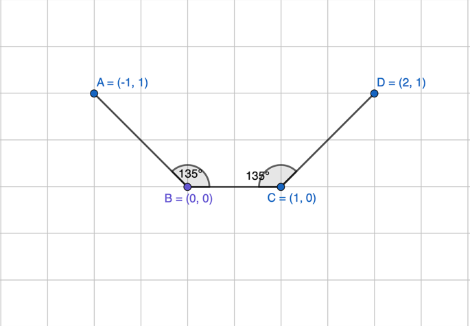
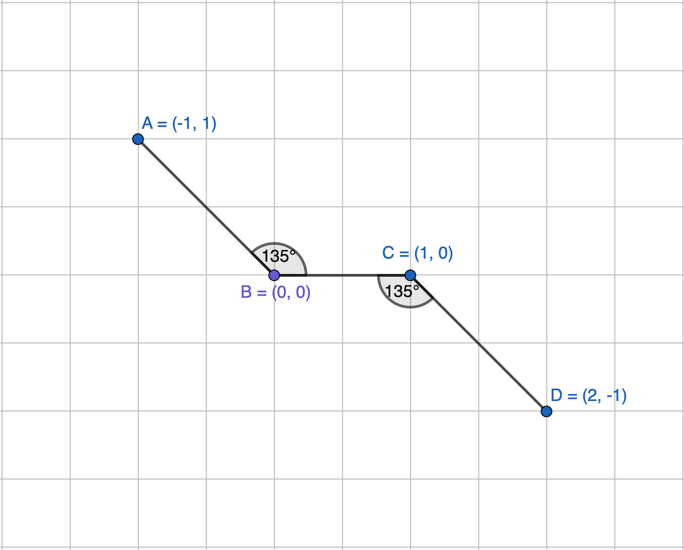

# Geometric Weisfeler Leman Test 

This repo contains a very minimal implementation of the GWL and IGWL tests.  
The test was introduced in the paper [On the Expressive Power of Geometric Graph Neural Networks](https://arxiv.org/pdf/2301.09308).
It compares the two tests, namely GWL and IGWL on very simple toy graphs to see how they compare. 

The graphs are shown below:

<table>
  <tr>
    <td></td>
    <td></td>
  </tr>
</table>

These graphs show the difference between the two tests pretty well since:
- Their 1-hop local neighborhoods are similar up to a rotation.
- Each node has the same local invariances (angles and distances/vectors)
- They are globally different. 

This makes them good to highlight the distinction that:
- **IGWL** only considers 1-hop invariants, so it cannot tell the graphs apart.  
- **GWL** expands hop sets with each iteration, so by \(t=2\) it can distinguish them in this toy example.

To run the project, please do the following:
- install pytorch in an environment
- clone this repository 
- run the `main.py` file and check the printed outputs. They will tell you which test was able to distinguish the two graphs
  - SPOILER ALERT: GWL was able to distinguish, IGWL was not.

You can also play around with other graphs by modifying `XA`, `XB` and `edges` in the ```main.py``` file 

Depending on the complexity of the graph you will use once you modify, you might need more than 2 iterations.

If I get time, I will make the itirations automatically terminate when no node color has changed after an itiration instead of setting the number of itirations. For now, `num_iter <= number of nodes -1`.  
*** 
**Merci Beacoup!**
***

